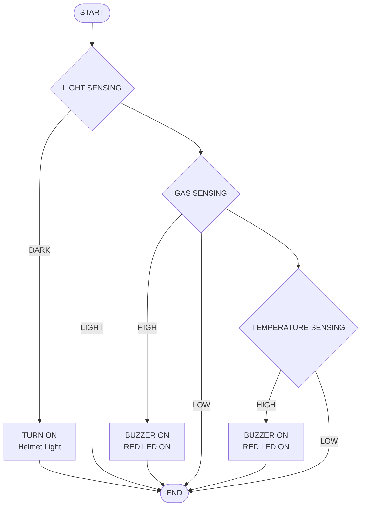

# Smart Safety Helmet — Arduino Uno

An Arduino-based smart helmet system that monitors ambient light, hazardous gas concentration, and body/ambient temperature. It automatically switches on a helmet light in low-light conditions and triggers an audible + visual alarm (buzzer + red LED) when gas or temperature levels become dangerous.

---

## 1. Hardware Required

| Component                          | Notes                              |
|-------------------------------------|-------------------------------------|
| Arduino Uno                         | Main controller                    |
| MQ-2 Gas Sensor                     | Analog output                      |
| Photoresistor (LDR) + 10K resistor  | Voltage divider for light sensing  |
| DS18B20 Temperature Sensor          | OneWire digital sensor             |
| Buzzer                              | Digital output (alarm)             |
| NPN Transistor + Helmet Light (LED) | Switched load for helmet light     |
| Red LED + 120Ω resistor             | Alarm indicator                    |
| Power supply (battery/USB)          | +VCC / GND                         |

---

## 2. Pin Connections

| Arduino Uno Pin | Connected To                       | Function                          |
|------------------|-------------------------------------|------------------------------------|
| **A0**           | Photoresistor (10K resistor divider)| Reads ambient light level          |
| **A1**           | MQ-2 Gas Sensor (signal)            | Reads gas concentration            |
| **D7**           | Buzzer                              | Sounds alarm                       |
| **D8**           | Helmet Light (via NPN transistor)   | Switches helmet light on/off       |
| **D9**           | Red LED (120Ω resistor)             | Visual alarm indicator             |
| **D11**          | DS18B20 Temperature Sensor (OneWire)| Reads temperature                  |
| **+VCC**         | Power Supply                        | 5V power to sensors/modules        |
| **GND**          | Common Ground                       | Ground reference for all modules   |

> **Note:** In code comments, pin labels (A0/A1) are swapped relative to the actual pin assignments — the wiring table above reflects the **actual pin numbers used in code** (`pResistor = A0`, `gasSensor = A1`).

### Wiring Diagram (Text Form)

```
                 ┌─────────────────────┐
   Photoresistor │                     │
   (10K divider)─┤ A0                  │
                 │                     │
    MQ-2 Gas     │                     │
    Sensor ───────┤ A1                  │
                 │                     │
    Buzzer ───────┤ D7      ARDUINO    │
                 │          UNO       │
    Helmet Light │                     │
   (NPN transistor)┤ D8                 │
                 │                     │
    Red LED ──────┤ D9                  │
   (120Ω resistor)│                     │
                 │                     │
   DS18B20 Temp  │                     │
    Sensor ───────┤ D11                 │
                 │                     │
   Power Supply ──┤ +VCC                │
   Ground ────────┤ GND                 │
                 └─────────────────────┘
```

---

## 3. System Flowchart



### Flow Description

1. **START** — system initializes (sensors begin, 10s MQ-2 warm-up delay).
2. **Light Sensing** — photoresistor value is read.
   - If **DARK** → helmet light (D8) is turned **ON**.
   - If **LIGHT** → helmet light stays off, proceed to next check.
3. **Gas Sensing** — MQ-2 gas sensor value is read.
   - If **HIGH** (above safe threshold) → buzzer (D7) and red LED (D9) turn **ON**, with beep frequency/speed increasing as gas level rises.
   - If **LOW** → alarm stays off.
4. **Temperature Sensing** — DS18B20 temperature is read.
   - If **HIGH** (above safe threshold) → buzzer and red LED turn **ON**, with beep speed increasing as temperature rises.
   - If **LOW** → alarm stays off.
5. **END** — loop repeats continuously (`void loop()`).

---

## 4. Behavior Summary

| Condition                  | Action                                   |
|-----------------------------|-------------------------------------------|
| Low ambient light (dark)    | Helmet light (D8) turns ON                |
| Gas level rising above safe threshold | Buzzer + Red LED activate; alarm rate increases with severity |
| Temperature rising above safe threshold | Buzzer + Red LED activate; alarm rate increases with severity |
| Normal/safe readings        | Buzzer and red LED remain OFF             |

---

## 5. Libraries Used

- [`OneWire`](https://www.arduino.cc/reference/en/libraries/onewire/)
- [`DallasTemperature`](https://www.arduino.cc/reference/en/libraries/dallastemperature/)

Install both via **Arduino IDE → Sketch → Include Library → Manage Libraries**.

---

## 6. Configuration Constants

| Variable   | Default | Description                                  |
|------------|---------|-----------------------------------------------|
| `dTemp`    | 35      | Baseline/default temperature (°C)             |
| `dGas`     | 400     | Baseline/default gas sensor reading (0–1023)  |
| `bValue`   | 10      | Brightness threshold for helmet light trigger |

Adjust these constants to calibrate the system to your environment.

---

## 7. Upload Instructions

1. Wire the components per the **Pin Connections** table above.
2. Open the sketch in Arduino IDE.
3. Install `OneWire` and `DallasTemperature` libraries.
4. Select **Board: Arduino Uno** and the correct COM port.
5. Upload the sketch.
6. Allow the 10-second MQ-2 sensor warm-up on startup before relying on gas readings.
